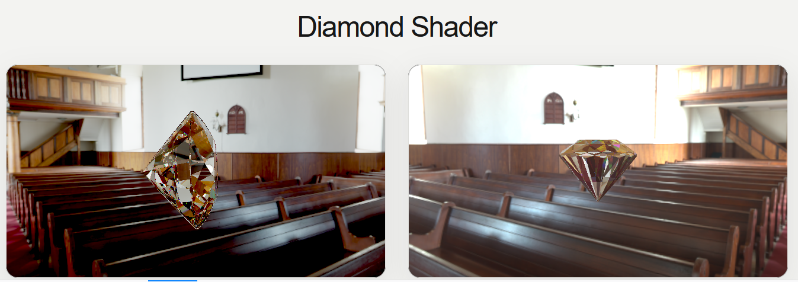

# 💎 Diamond Shader Lab

**A physically driven real-time diamond renderer built to achieve the most realistic result possible in the browser.**

## Overview

Diamond Shader Lab explores two advanced GPU rendering techniques for creating a highly realistic diamond in real time:

* **Physical Photon Shader** — a custom GLSL approach focused on physically inspired light behavior.
* **Multi-Bounce Mesh Refraction** — geometry-based rendering with repeated internal refraction and reflection.

Every frame is generated live on the GPU — no pre-rendered video or baked animation.

## Highlights

* Real-time WebGL rendering
* Custom GLSL shaders
* Physically inspired reflection and refraction
* Interactive 3D presentation
* Runs directly in the browser

## Built With

`Next.js` · `React` · `Three.js` · `WebGL` · `GLSL`

---

## Let's Build Something Exceptional

Experience the renderer directly in the **[Live Demo](https://ehsanwwe.github.io/diamond-shader/)** and see the diamond running in real time inside your browser.

Interested in real-time graphics, shaders, interactive experiences, or ambitious web products? I'm open to collaborations and challenging projects.

If you enjoy this experiment, consider giving the repository a **Star** — it helps the project reach more developers and creators.

 

Built by <strong>Ehsan Moradi</strong>

