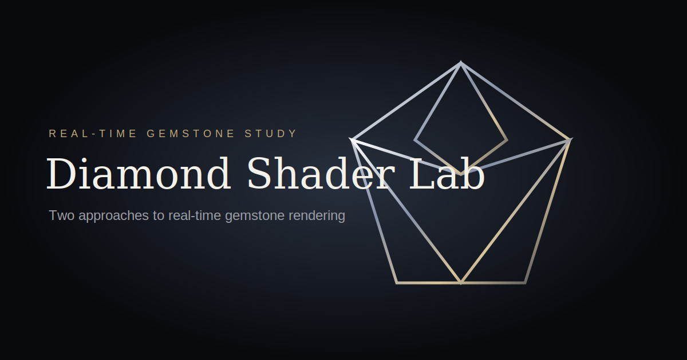
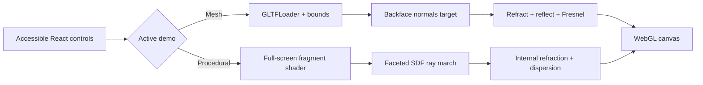

<div align="center">
  
  <h1>Diamond Shader Lab</h1>
  <p><strong>Light, cut into code.</strong></p>
  <p>Two approaches to real-time gemstone rendering.</p>
  <p><a href="https://ehsanwwe.github.io/"><strong>Live demo</strong></a></p>
  <p>   </p>
</div>

Diamond Shader Lab modernizes Ehsan Moradi's legacy Three.js experiment into a focused, production-quality graphics showcase. It exists to make two very different answers to the same rendering problem easy to see, touch, and study—without remote runtime assets or a server after build.

## Two rendering approaches

| | Mesh + Shader | Shader Only |
|---|---|---|
| Shape | Supplied `ehsan.gltf` brilliant cut | Procedural faceted SDF |
| Carrier | Diamond mesh | Full-screen plane only |
| Optics | Backface-normal target + front shader | Ray-marched volume |
| Strength | Exact authored silhouette | No gemstone geometry dependency |

Both pipelines implement custom GLSL reflection, refraction, Fresnel response, local analytical environment lighting, and chromatic dispersion. Only the selected demo owns a WebGL context and animation loop.

## Highlights

- Direct Three.js rendering with deterministic React lifecycle cleanup
- Responsive, DPR-capped render targets and model framing from bounds
- Touch, pointer, keyboard-accessible controls, OrbitControls damping, and reduced-motion support
- Context-loss, loading, unsupported-WebGL, and asset-error states
- Fully static Next.js App Router export with root and project-page base paths
- No CDN, remote texture, font, model, API, database, or runtime Node.js dependency

## Controls

Choose **Mesh + Shader** or **Shader Only**. Drag the canvas to orbit/rotate; use the wheel or pinch to zoom the mesh demo. Sliders tune IOR, exposure/brightness, dispersion, tint or contrast, and animation speed. **Reset** restores the studied defaults.

## Technology

Next.js 16, React 19, strict TypeScript, Three.js, WebGL, GLSL, GLTFLoader, and OrbitControls. The interface uses plain CSS and needs no animation framework.

## Local development and static build

```bash
npm install
npm run dev
```

Production validation:

```bash
npm run typecheck
npm run lint
npm run build
npm run verify:export
```

The deployable site is written to `build/`. You can serve that folder with any static file server; Node.js is not needed in production.

To test a project-page path locally at build time:

```bash
NEXT_PUBLIC_BASE_PATH=/diamond-shader-lab npm run build
```

## GitHub Pages deployment

The workflow detects the repository from `GITHUB_REPOSITORY`. `ehsanwwe.github.io` exports at `/`; any other repository exports at `/<repository>/`. An explicit `NEXT_PUBLIC_BASE_PATH` overrides detection. In repository **Settings → Pages**, select **GitHub Actions** as the source, then push `main` or dispatch the workflow manually.



## Project structure

```text
src/app/                 static App Router shell and metadata
src/components/diamond/ active-demo UI and controls
src/lib/three/           render lifecycle and both pipelines
src/shaders/             readable typed GLSL sources
public/models/           runtime copy of the supplied GLTF
public/brand/            favicon and vector social preview
scripts/                 export normalization and verification
reference/               untouched historical source material
```

## Performance and browser support

Device pixel ratio is capped at 2, rendering pauses while the document is hidden, and only the active demo runs. The procedural tracer uses bounded loops (54 exterior and 34 interior steps), while resize observers rebuild GPU targets only when needed. The experience targets current WebGL-capable evergreen browsers; browsers without WebGL receive a clear message. Exact performance depends on GPU and viewport size, so no synthetic benchmark is claimed.

## Legacy mapping

| Legacy source | Modern destination |
|---|---|
| `reference/main.js` | `src/lib/three/meshDiamond.ts` |
| `DiamondVertex.glsl`, `DiamondFragment.glsl` | `src/shaders/mesh.ts` (corrected and redesigned) |
| Backface shaders | Dedicated `backScene` and encoded world-normal pass |
| `reference/main2d.js` | `src/lib/three/proceduralDiamond.ts` |
| `DiamondFragment2d.glsl` | `src/shaders/procedural.ts` (modern reconstruction) |
| Blade templates | Replaced by the App Router showcase; never imported |

The task brief described `DiamondFragment2d.glsl` as absent, but the supplied `reference/shaders/` directory in this repository does contain it. The new shader remains a clean reconstruction of the surviving interface and artistic intent rather than a blind port: it removes the cube GLTF carrier, repairs unsafe state, and produces the diamond procedurally. Missing cubemap images were not downloaded; a local analytical environment replaces them.

## Contributing, license, and credit

Contributions are welcome—see [CONTRIBUTING.md](CONTRIBUTING.md). Released under the [MIT License](LICENSE). Original experiment and this showcase are credited to **Ehsan Moradi**.

The 360° viewport environment is **Studio Small 03** by Greg Zaal via [Poly Haven](https://polyhaven.com/a/studio_small_03), released under CC0. It is projected equirectangularly and sampled by the custom shaders for the visible background, reflections, and refractions.

Suggested topics: `threejs`, `webgl`, `glsl`, `shaders`, `nextjs`, `creative-coding`, `raymarching`, `procedural-generation`, `realtime-graphics`.
