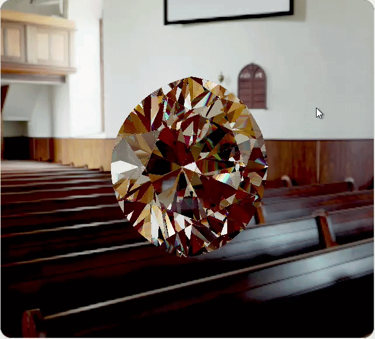

# 💎 Diamond Shader Lab

**A physically driven real-time diamond ring renderer built to achieve the most realistic result possible in the browser.**

> Every frame above is rendered live on the GPU — no pre-rendered video, no baked animation.

## Overview

Diamond Shader Lab renders a silver halo diamond ring in real time: a large centre stone held by six prongs, a halo of fourteen small stones, and five shoulder stones sunk into each side of the band. Every stone is shaded by a custom GLSL diamond tracer; the silver is a physically based metal. Both are lit by the same 360° HDR environment.

## How It Works

**Modelled in Blender** — the ring is generated by `scripts/blender_diamond_ring.py` (open `diamond_ring.blend`, or run it headless with `blender -b diamond_ring.blend -P scripts/blender_diamond_ring.py`) and exported to `public/models/diamond-ring.glb`. Every stone is an instance of the brilliant-cut diamond in `public/models/math-diamond.gltf`, itself built by `scripts/blender_math_diamond.py`, so the geometry the shader traces is exactly the geometry you see.

**Convex-hull diamond tracer** — each stone's facet planes are extracted from its convex hull at load time and uploaded to a per-stone material. The fragment shader traces the ray from the rasterised surface point through the stone: Fresnel reflection on entry, refraction, up to five internal bounces (total internal reflection), then exit — with the three colour channels traced at slightly different IOR for chromatic dispersion. Fire and sparkle emerge from the light path itself rather than from textures.

**Silver and post-processing** — the band is a PBR metal lit by a prefiltered copy of the HDR environment. An HDR post chain adds bloom and a small star lens-flare pass on the brightest glints before the sRGB output.

## Highlights

- Real-time WebGL rendering
- Custom GLSL diamond tracer with multi-bounce refraction and dispersion
- Physically inspired reflection, refraction and dispersion
- Ring modelled procedurally in Blender, script included
- Interactive orbit and zoom, runs directly in the browser

## Built With

`Next.js` · `React` · `Three.js` · `WebGL` · `GLSL` · `Blender`

---

## Let's Build Something Exceptional

Experience the renderer directly in the **[Live Demo](https://ehsanwwe.github.io/diamond-shader/)** and see the ring running in real time inside your browser.

Interested in real-time graphics, shaders, interactive experiences, or ambitious web products? I'm open to collaborations and challenging projects.

If you enjoy this experiment, consider giving the repository a **Star** — it helps the project reach more developers and creators.

Built by **Ehsan Moradi**
